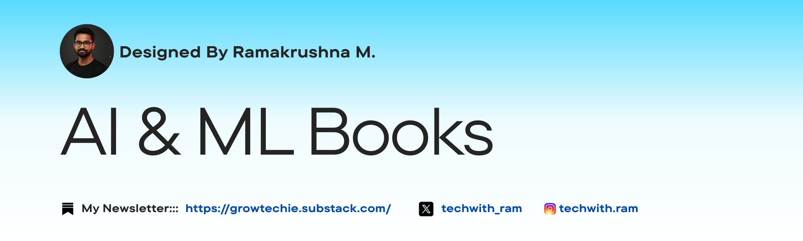

# AI & Machine Learning Book References

<p align="center">
  <a href="https://github.com/Ramakm/AI-ML-Book-References/stargazers">
    
  </a>
  <a href="https://github.com/Ramakm/AI-ML-Book-References/network/members">
    
  </a>
  <a href="https://github.com/Ramakm/AI-ML-Book-References/issues">
    
  </a>
  <a href="https://github.com/Ramakm/AI-ML-Book-References/pulls">
    
  </a>
  <a href="https://github.com/Ramakm/AI-ML-Book-References/graphs/contributors">
    
  </a>
  <a href="https://github.com/Ramakm/AI-ML-Book-References/blob/main/LICENSE">
    
  </a>
</p>
A comprehensive curated collection of essential resources for artificial intelligence and machine learning practitioners, researchers, and enthusiasts.




## About This Repository

This repository serves as a structured knowledge hub for individuals passionate about advancing their expertise in artificial intelligence, machine learning, deep learning, and related data science disciplines. Each reference has been carefully selected to provide foundational knowledge, practical implementations, and cutting-edge insights in the field.

Whether you're beginning your journey into AI/ML or looking to deepen your expertise, this collection provides authoritative resources across multiple domains including neural networks, natural language processing, computer vision, statistical learning, and practical engineering applications.

---

## Book References

| # | Title | Author(s) | Topic Area | Key Focus | Level | Link |
|---|-------|-----------|-----------|-----------|-------|------|
| 1 | Designing Machine Learning Systems | - | Machine Learning | Iterative processes for production-ready systems | Intermediate | [Read Here]("https://drive.google.com/file/d/15anabTQtr_rM8xTiyz4nXne-C_StnllU/view?usp=sharing") |
| 2 | Python for Data Analysis | Wes McKinney | Data Science | Data manipulation and analysis with Python | Beginner | - |
| 3 | SQL Cookbook | Anthony Molinaro | Databases | Query solutions and SQL techniques | Intermediate | - |
| 4 | AI Engineering | Chip Huyen | Artificial Intelligence | Building AI applications with foundation models | Advanced | - |
| 5 | Deep Learning from Scratch | - | Deep Learning | Building neural networks from first principles | Intermediate | - |
| 6 | Hands-On Machine Learning with Scikit-Learn & TensorFlow | Aurélien Géron | Machine Learning | Practical ML concepts and tools | Beginner-Intermediate | - |
| 7 | Human-in-the-Loop Machine Learning | - | Machine Learning | Active learning and annotation strategies | Intermediate | - |
| 8 | Machine Learning with Python Cookbook | Afamefuna Umeh & Chris Albon | Data Science | Practical solutions from preprocessing to deep learning | Intermediate | - |
| 9 | Mathematics for Inference and Machine Learning | - | Mathematics | Mathematical foundations for ML applications | Advanced | - |

| 10 | Building Machine Learning Systems | - | Machine Learning | System design and orchestration | Intermediate | - |
| 11 | Introduction to Deep Learning | Cao Xiao & Jimeng Sun | Deep Learning | Introductory deep learning concepts and architectures | Beginner-Intermediate | - |
| 12 | Data Analysis with NumPy and pandas | - | Data Science | Data manipulation and processing with NumPy and pandas | Beginner-Intermediate | - |
| 13 | Data Visualization with Python and JavaScript | - | Data Visualization | Techniques to scrape, clean, explore, and visualize data | Intermediate | - |
| 14 | Data Science for Business | Foster Provost & Tom Fawcett | Data Science | Data mining and analytic thinking for business | Intermediate | - |
| 15 | Computer Vision: A Modern Approach | David A. Forsyth & Jean Ponce | Computer Vision | Principles and algorithms for vision systems | Advanced | - |
| 16 | Deep Learning Methods and Applications | - | Deep Learning | Methods and real-world deep learning applications | Intermediate | - |
| 17 | Deep Learning with Applications | - | Deep Learning | Applied deep learning case studies | Intermediate | - |
| 18 | The Elements of Statistical Learning | Trevor Hastie, Robert Tibshirani & Jerome Friedman | Statistics / ML | Statistical learning theory and methods | Advanced | - |
| 19 | Exercises in Machine Learning | Michael U. Gutmann | Practice | Exercises and problem sets for ML concepts | Intermediate | - |
| 20 | Feature Engineering for Machine Learning | Alice Zheng & Amanda Casari | Data Preparation | Feature engineering techniques for predictive models | Intermediate | - |
| 21 | Graph Machine Learning | - | Graph ML | Graph-based machine learning techniques and algorithms | Intermediate | - |
| 22 | Machine Learning for Absolute Beginners | - | Machine Learning | Introductory concepts and practical examples for beginners | Beginner | - |
| 23 | Python Machine Learning | - | Machine Learning / Python | Practical machine learning examples using Python | Beginner-Intermediate | - |
| 24 | Quantitative Economics with Python | Thomas J. Sargent & John Stachurski | Economics / Data Science | Quantitative economics and econometrics with Python | Intermediate-Advanced | - |
| 25 | The Little Book of Deep Learning | François Fleuret | Deep Learning | Concise overview of deep learning concepts | Beginner-Intermediate | - |

---

## Repository Structure

```
AI-ML-Book-References/
├── README.md
└── LICENSE
```

## How to Use This Repository

- Browse through the reference table to find books relevant to your learning goals
- Filter by topic area or expertise level to identify appropriate resources
- Each book has been selected for its pedagogical value and industry relevance
- References span from foundational concepts to advanced implementation techniques

## Learning Paths

### For Beginners
Start with fundamental concepts in Python for Data Analysis and Hands-On Machine Learning to build a solid foundation.

### For Intermediate Learners
Explore specialized topics through SQL Cookbook, Machine Learning with Python Cookbook, and Mathematics for Inference and Machine Learning.

### For Advanced Practitioners
Deepen expertise with Deep Learning from Scratch, AI Engineering, and Designing Machine Learning Systems.

---

## Contributing

Recommendations for new book references are welcome. Please ensure suggested materials:
- Provide substantial value to AI/ML practitioners
- Maintain current relevance in the field
- Contribute unique perspectives or expertise

## License

This repository is licensed under the MIT License. See the LICENSE file for details.

## Connect with me

[](https://x.com/techwith_ram)
[](https://instagram.com/techwith.ram)
[](https://github.com/Ramakm)
